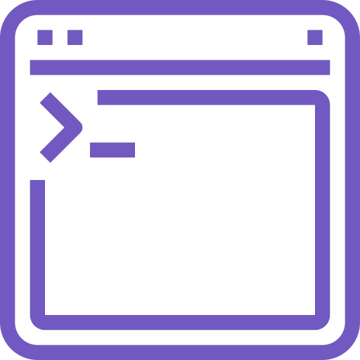

<h1 align="center">
  CLI kyara
</h1>

<h1 align="center">
  
</h1>

  

## :gear: Requisítos

- [ ] [Node.js](https://nodejs.org/en/) ( Obrigatório )
- [ ] [GIT](https://git-scm.com/) ( Opcional )

## :rocket: Tecnologias

- [x] [Node.js](https://nodejs.org/en/)
- [x] [gluegun](https://infinitered.github.io/gluegun/#/)

## :computer: Projeto

kyara é uma CLI ( command line interface ) com o intuito de automatizar tarefas do meu dia dia.

## :checkered_flag: Updates

Este projeto está em sua versão beta, em desenvolvimento.

## :bookmark_tabs: Ideias de implementação

- [ ] Novos comandos

## :arrow_down: Instalação

- `npm install -g kyara`;
- `yarn global add kyara`;

## Comandos
`kyara --version or kyara -v`: Mostra a versão da CLI.
`kyara --help or kyara -h`: Exibe a ajuda.
`kyara create-chrome-extensions [path] [name] or kyara ce [path] [name]`: Cria uma base para extnções para o chrome.
`kyara create-node-app [path] [name] or kyara n [path] [name]`: Cria uma estrutura de diretório para app feitos com node.Js.
`kyara dir`: Exibe o diretório atual.
`kyara os`: Exibe informações do sistema operacinal.     

## :thinking: Como contribuir

- Faça um fork desse repositório;
- Cria uma branch com a sua feature: `git checkout -b minha-feature`;
- Faça commit das suas alterações: `git commit -m 'feat: Minha nova feature'`;
- Faça push para a sua branch: `git push origin minha-feature`.

Depois que o merge da sua pull request for feito, você pode deletar a sua branch.

## :memo: Licença

Esse projeto está sob a licença MIT. Veja o arquivo [LICENSE](LICENSE.md) para mais detalhes.

