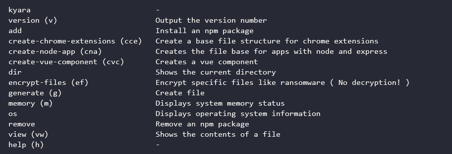

<h2 align="center">kyara CLI</h2> 

<p align="center">
          
</p>

<div align="center">
    
</div>

## ⚙ Requirements

- [X] [npm](https://www.npmjs.com/) or [yarn](https://yarnpkg.com/)

## 🛠 Technology

- [Node.js](https://nodejs.org/en/)
- [Gluegun](https://infinitered.github.io/gluegun/#/)

## 💻 Project

kyara is a CLI (command line interface) in order to automate my daily tasks as a developer.

## 💡 Implementation ideas

- [ ] Add new commands;
- [ ] Refactor the code of the existing commands.

## ⬇ Installation

Using npm:

```bash
npm install -g kyara
```

Using yarn:

```bash
yarn global add kyara
```

**Note:** I recommend that you install **globally**, so you can use it anywhere on your machine and gluegun does not support installation for specific folders.

## 🆘 Commands

To consult the list of commands just type **`kyara -h`** or **`kyara --help`**. <br>
Detailed command list [here](https://github.com/Rogerluiz0/kyara/blob/master/docs/commands.md).

## 🤔 How to contribute

1. Fork this repository;
2. Create a branch with your feature: **`git checkout -b my-feature`**;
3. Commit your changes: **`git commit -m 'feat: My new feature'`**;
4. Push to your branch: **`git push origin my-feature`**.

After the merge of your pull request is done, you can delete your branch.

You can report a bug [here](https://github.com/roger3g/kyara/issues).

## 📝 License

This project is under the MIT license. See the archive [LICENSE](LICENSE.md) for more details.
